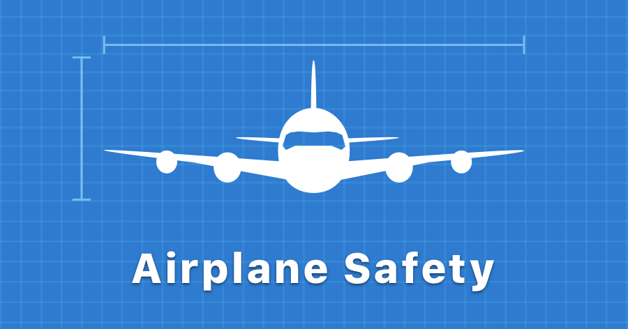

# Airplane Safety



This is the open source repository for the Airplane Safety project.

If you want to learn the story behind this project, [read the blog post here](https://www.stelabouras.com/blog/airplane-safety/).

This repository contains the scanned original documents (in Greek), the translated documents,
as well as the vector images accompanying the description in SVG and PDF formats.

I also include the Sketch project I used to design all the graphics used in this project.

All the resources contained in this project are open source under the MIT License.

## HTML version

If you want to visit a live HTML version of this project, visit [https://airplane-safety.stelabouras.com/](https://airplane-safety.stelabouras.com/).

## Generating the documents

The PDF, epub and LaTeX versions have been generated using the [Pandoc](https://pandoc.org/) tool.

If you want to re-generate those documents, [install and configure Pandoc](https://pandoc.org/installing.html) locally and run the
following commands:

* For the ePub version:

```
pandoc airplane-safety-epub.md -f markdown -t epub -s -o Airplane-Safety.epub --metadata title="Airplane Safety" --epub-cover-image=Cover.png
```

* For the LaTeX version:

```
pandoc airplane-safety-pdf-latex.md  -f markdown -t latex -s -o Airplane-Safety.latex
```

* For the PDF version:

```
pandoc airplane-safety-pdf-latex.md  -f markdown --pdf-engine=xelatex -s -o Airplane-Safety.pdf
```

